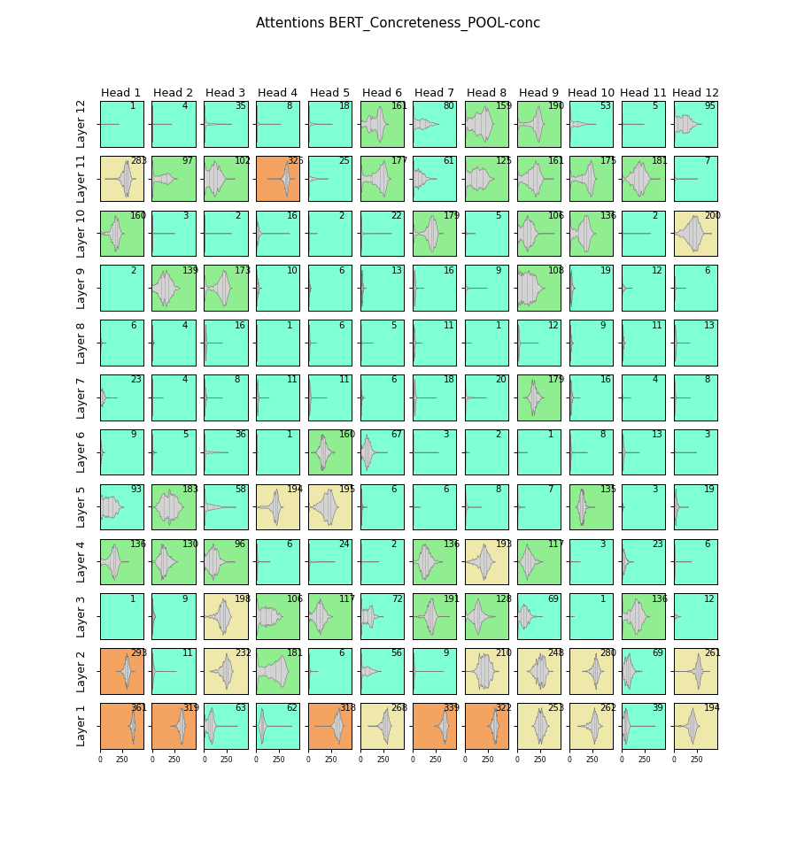
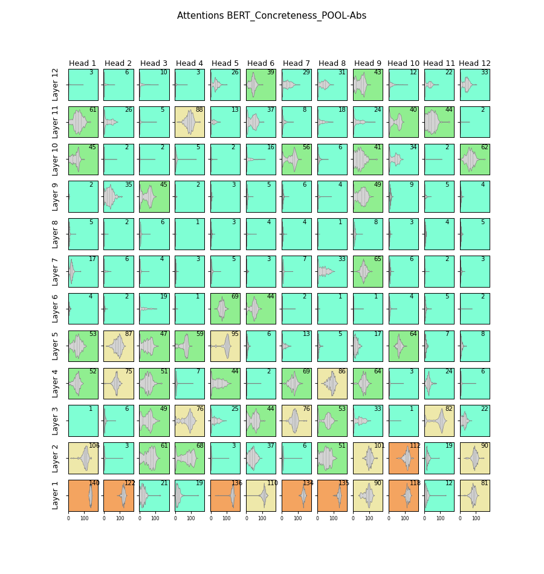

# BERT Attention Head Softmax Responses
The number of tokens in the softmax of attention heads required to reach 90% of the softmax vote.
The following figures are generated from questions from TVQA with either concrete or abstract answers. See below for explanation. 
We append the questions with either a highly concrete or abstract **pool** of MT40k words:
* **Sequences:** The questions, either highly concrete or abstract.
* **Pool:** The pool of answers appended to the above sequences. Concreteness from MT40k norm dataset. Also either concrete or abstract

## Concrete Questions
Conc Pool | Abs Pool
- | -
 | 
