# LXMERT-QA Attention Head Softmax Responses
The number of tokens in the softmax of attention heads required to reach 90% of the softmax vote.
The following figures are generated from questions from TVQA with either concrete or abstract answers. See below for explanation. 
We append the questions with either a highly concrete or abstract **pool** of MT40k words:
* **Sequences:** The questions, either highly concrete or abstract.
* **Pool:** The pool of answers appended to the above sequences. Concreteness from MT40k norm dataset. Also either concrete or abstract

**PLEASE NOTE:** Where the BERT models is one 'array' of layers and attention heads. **The LXMERT model variations has separate language and vision layers entirely, including something called cross attention.** These are evaluated individually:

## Language Attentions 
### Concrete Questions
Conc Pool|Abs Pool
-|-
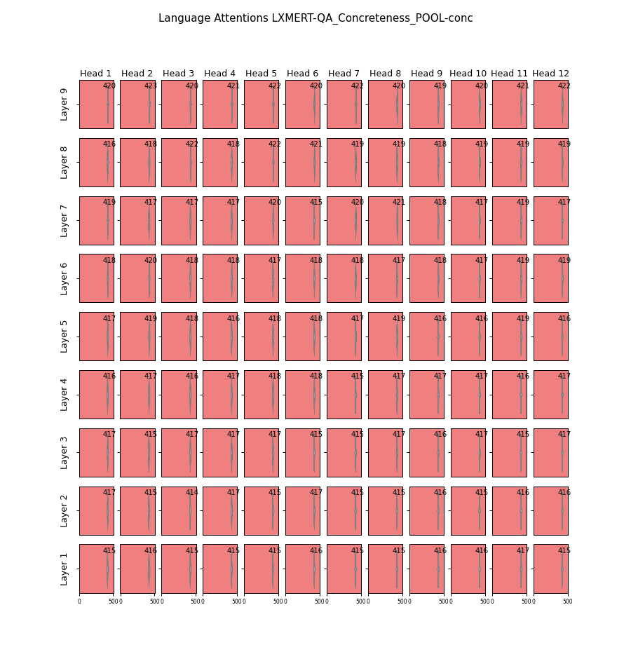|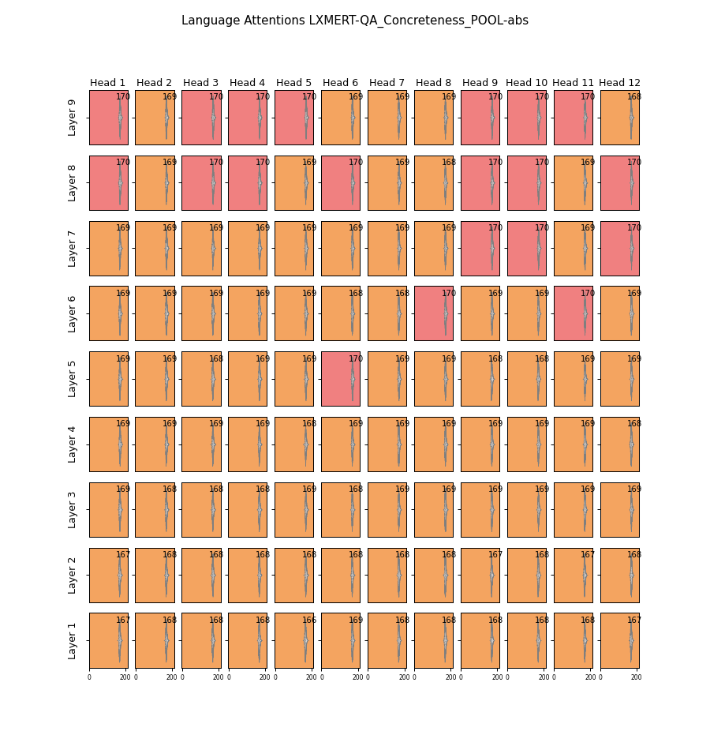

### Abstract Questions
Conc Pool|Abs Pool
-|-
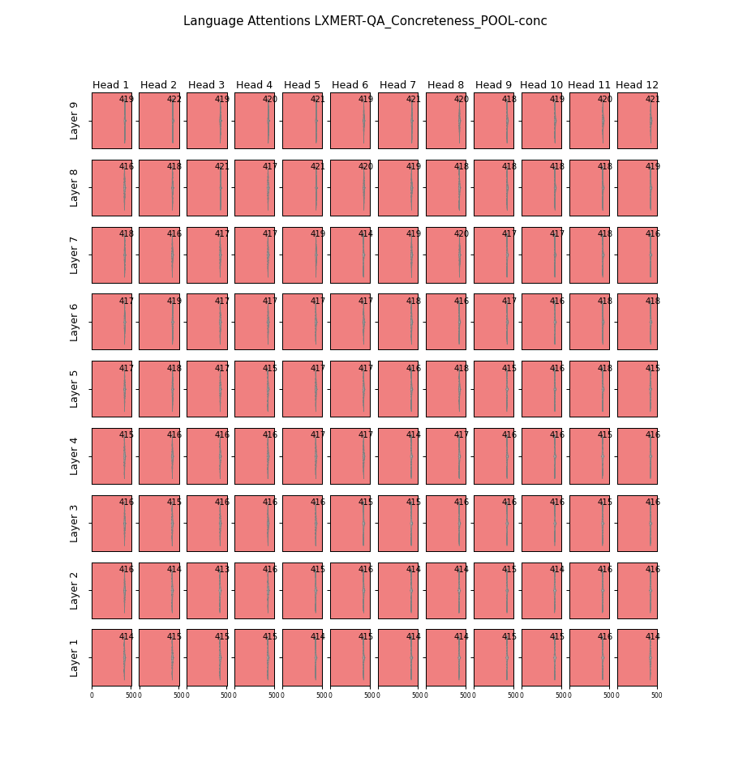|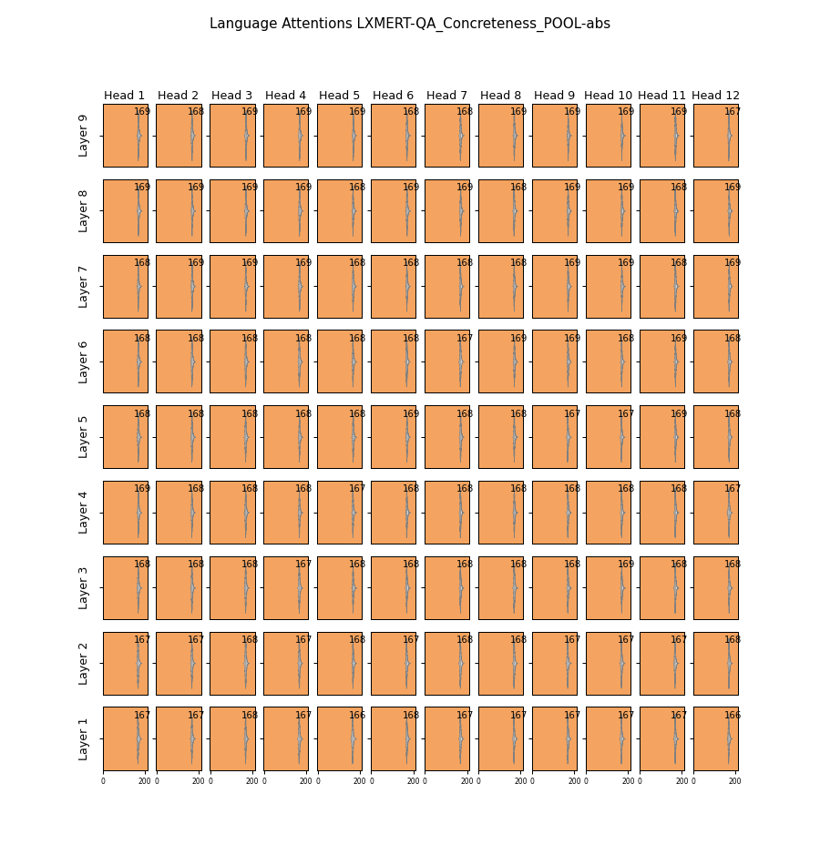

## Vision Attentions 
### Concrete Questions
Conc Pool|Abs Pool
-|-
|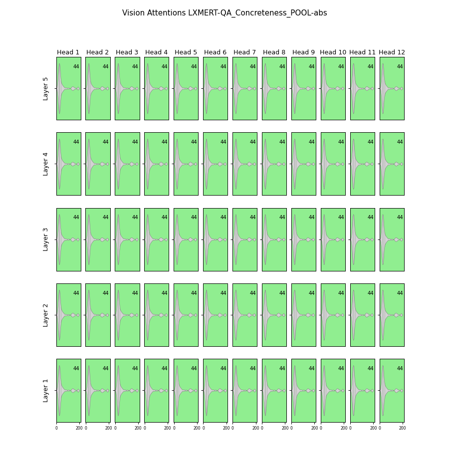

### Abstract Questions
Conc Pool|Abs Pool
-|-
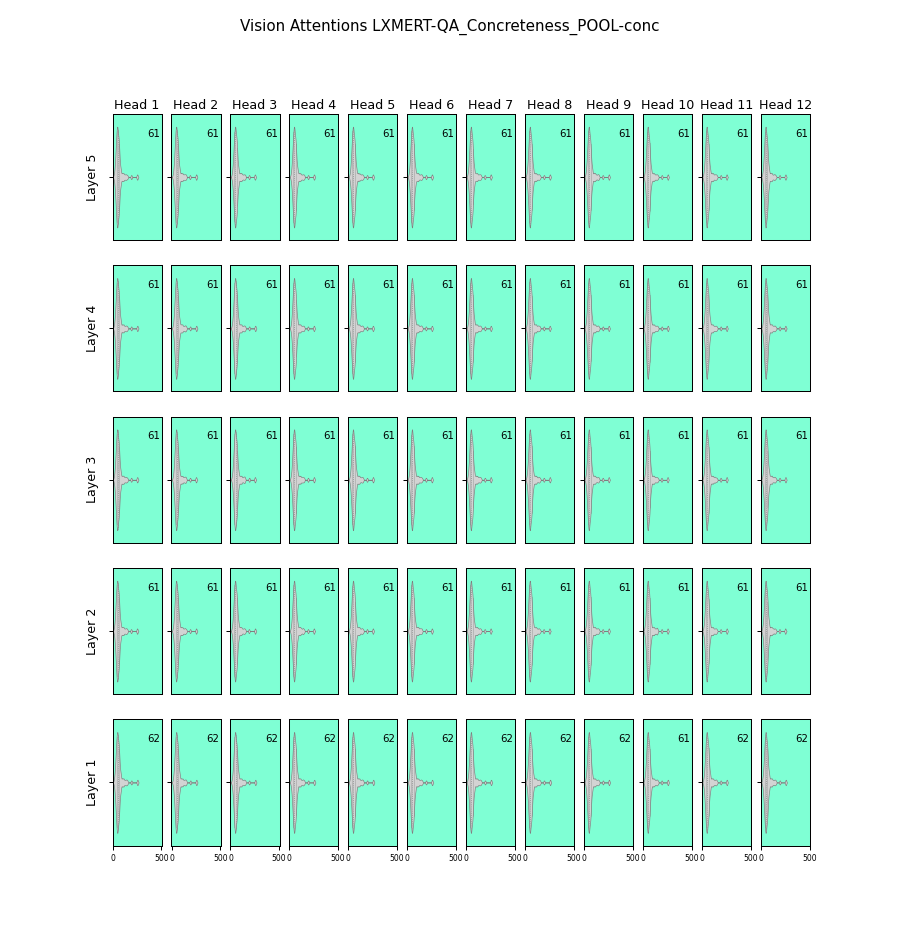|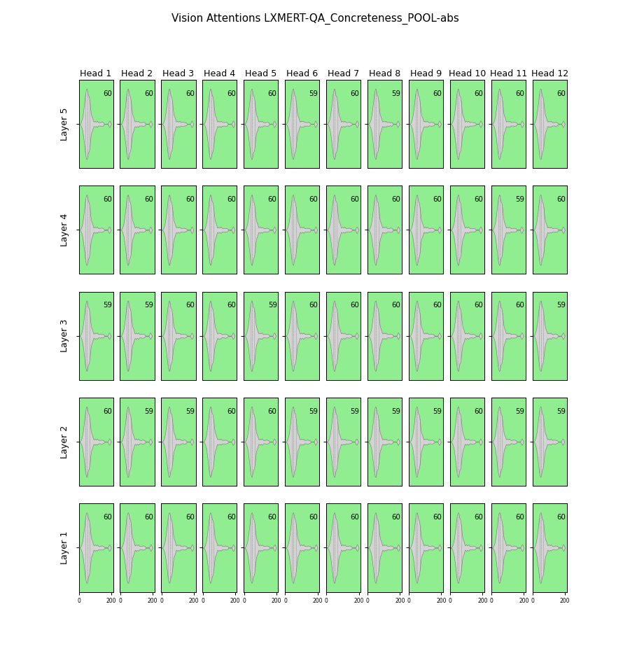

## Cross Attentions 
### Concrete Questions
Conc Pool|Abs Pool
-|-
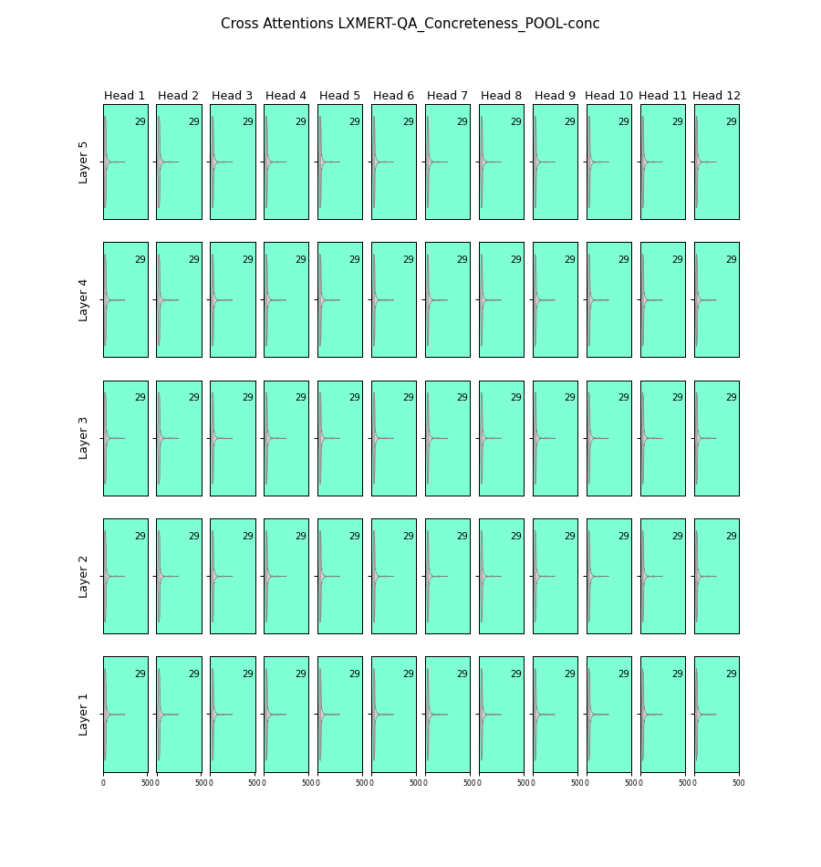|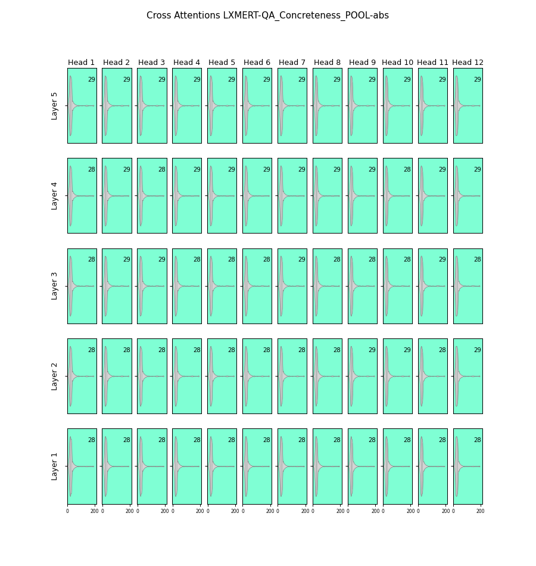

### Abstract Questions
Conc Pool|Abs Pool
-|-
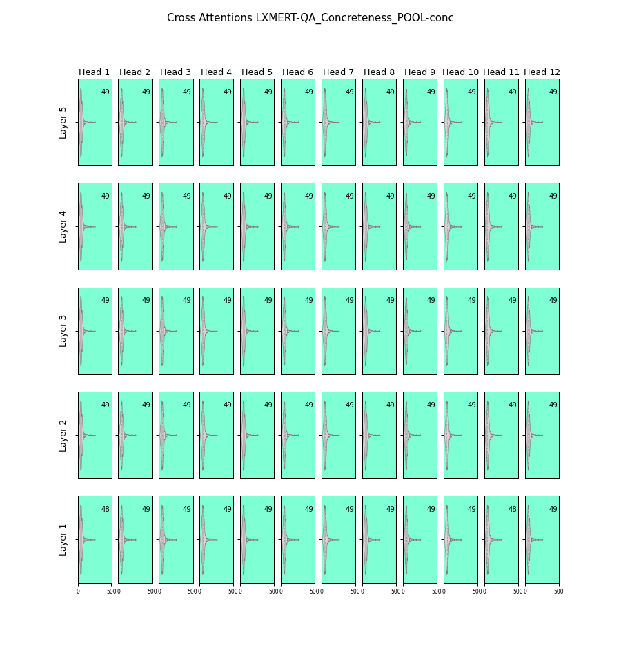|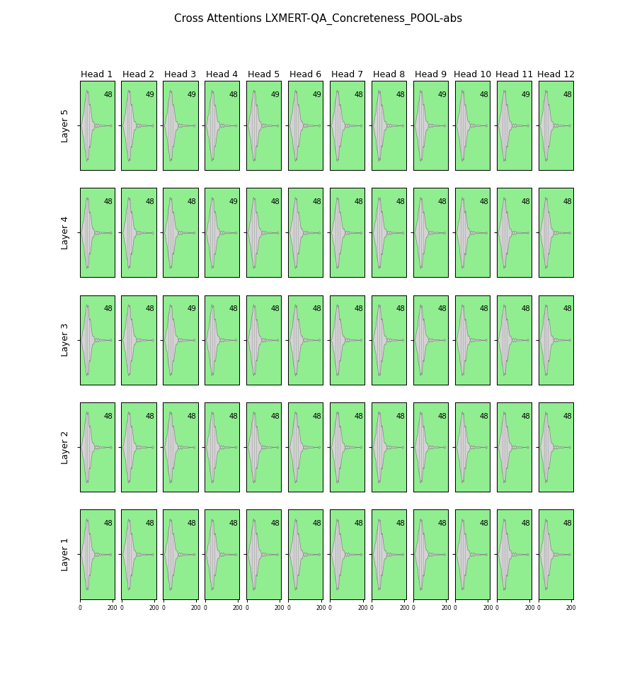
