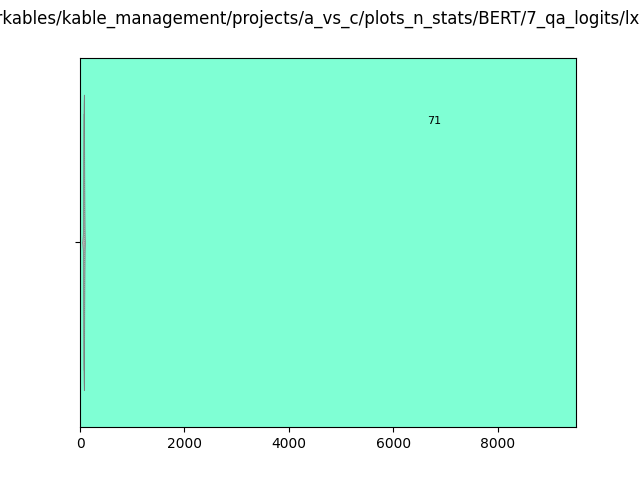
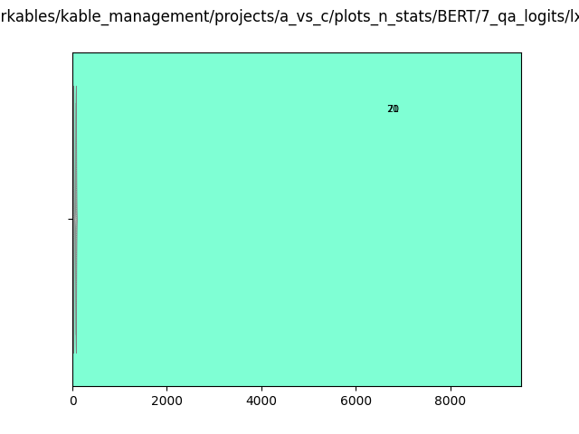

# Transformer QA-variant Logit Information
The huggingface transformer pytorch library is a blessing. We consider a study similar to the "softmax response" experiments previously done. We calculate the number of classes required to hit each softmax threshold of the output layer of the QA models.

# LXMERT-QA:
Conc Questions|Abs Questions
-|-
|
