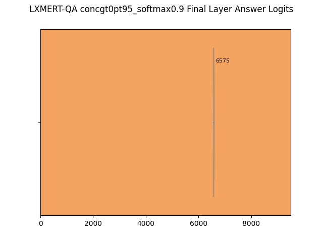
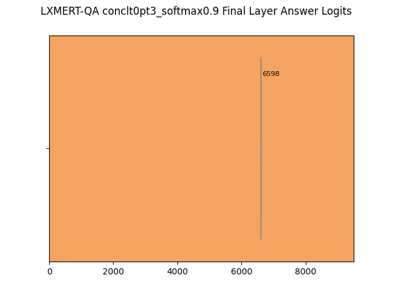
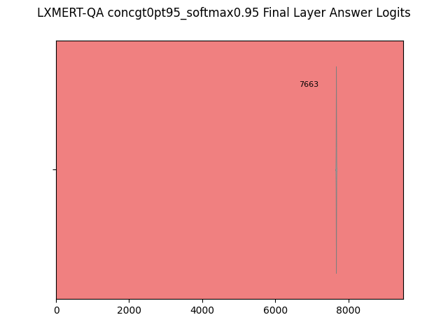
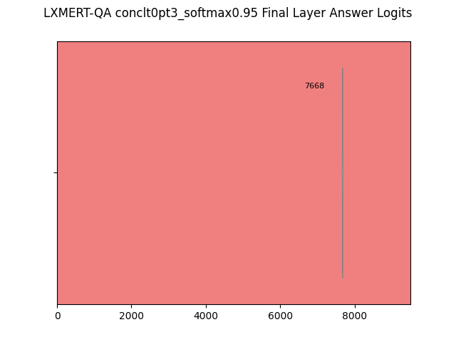
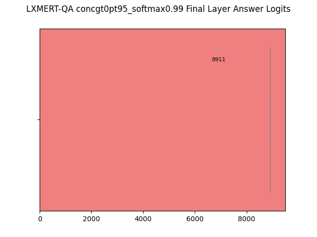
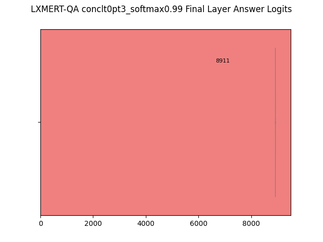
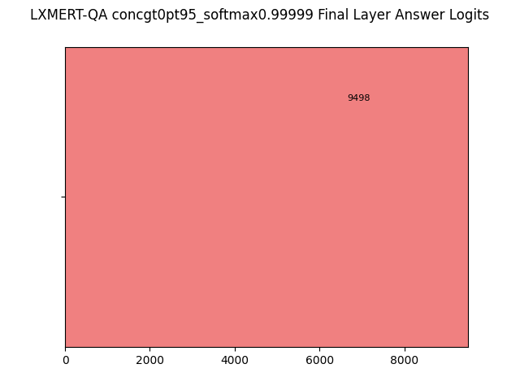
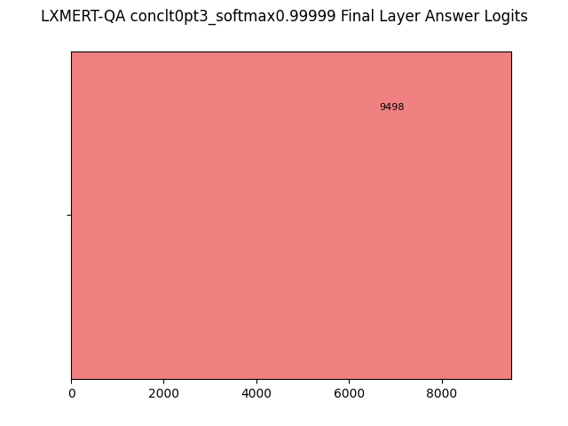

# Transformer QA-variant Logit Information
The huggingface transformer pytorch library is a blessing. We consider a study similar to the "softmax response" experiments previously done. We calculate the number of classes required to hit each softmax threshold of the output layer of the QA models.

# LXMERT-QA:
## Softmax Threshold > 0.5
Conc Questions|Abs Questions
-|-
|

## Softmax Threshold > 0.8
Conc Questions|Abs Questions
-|-
|

## Softmax Threshold > 0.9
Conc Questions|Abs Questions
-|-
|

## Softmax Threshold > 0.95
Conc Questions|Abs Questions
-|-
|

## Softmax Threshold > 0.99
Conc Questions|Abs Questions
-|-
|

## Softmax Threshold > 0.99999
Conc Questions|Abs Questions
-|-
|
