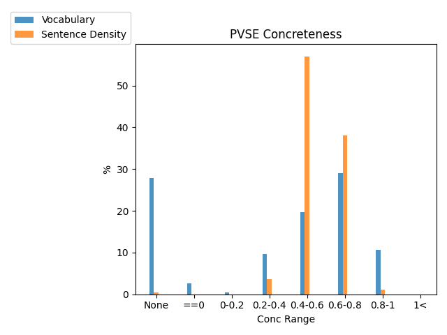
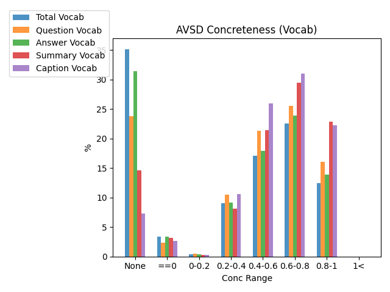

## PVSE
The `MRW` (my reaction when) split of the PVSE implemention
Concreteness Range | Total Vocab | Sentences\*
:-- | --: | --:
None    | 27.95%| 0.46%
0       | 2.62% | 0.02%
0-0.2   | 0.46% | 0.03%
0.2-0.4 | 9.59% | 3.71%
0.4-0.6 | 19.66%| 57.03%
0.6-0.8 | 29.01%| 38.04%
0.8-1 | 10.73%  | 1.18%
1+ | 0.00%  | 0.00%

## AVSD
<!---INSERT BARCHART
The Audio-Visual Scene-Aware Dialog Dataset. \* denotes the average concreteness across all words in each of feature.
Concreteness Range | Total Vocab | Question\* | Answer\* | Summary\* | Captions\*
:-- | --: | --: | --: | --: | --:
None    | % | % | % | % | %
0       | % | % | % | % | %
0-0.2   | % | % | % | % | %
0.2-0.4 | % | % | % | % | %
0.4-0.6 | % | % | % | % | %
0.6-0.8 | % | % | % | % | %
0.8-1   | % | % | % | % | %
1+      | % | % | % | % | %
-->
Concreteness of the **vocabulary** of each feature type:

Concreteness of the **actual** feature type:

## TVQA
The TVQA Dataset: \* denotes the average concreteness across all words in each of feature.
Concreteness Range | Total Vocab | Question\* | Correct Answer\* | Answer\* | Visual Concept\* | Subtitles\*
:-- | --: | --: | --: | --: | --: | --:
None    | % | % | % | % | % | %
0       | % | % | % | % | % | %
0-0.2   | % | % | % | % | % | %
0.2-0.4 | % | % | % | % | % | %
0.4-0.6 | % | % | % | % | % | %
0.6-0.8 | % | % | % | % | % | %
0.8-1   | % | % | % | % | % | %
1+      | % | % | % | % | % | %
