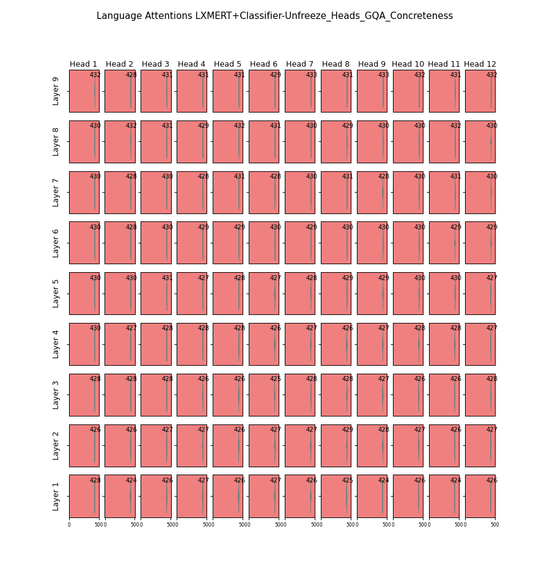
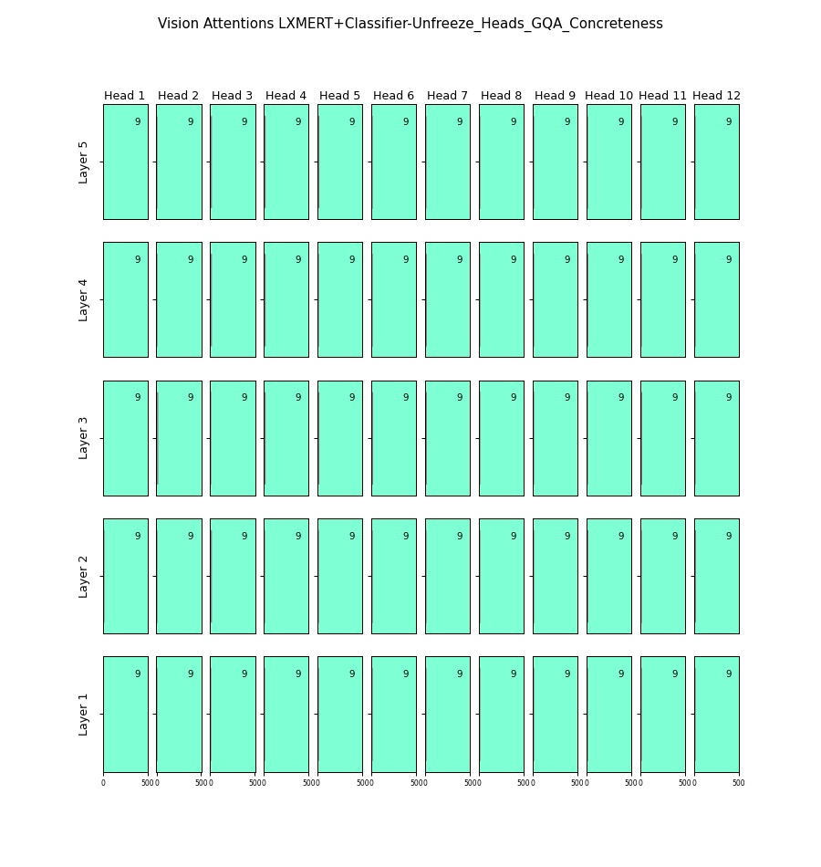
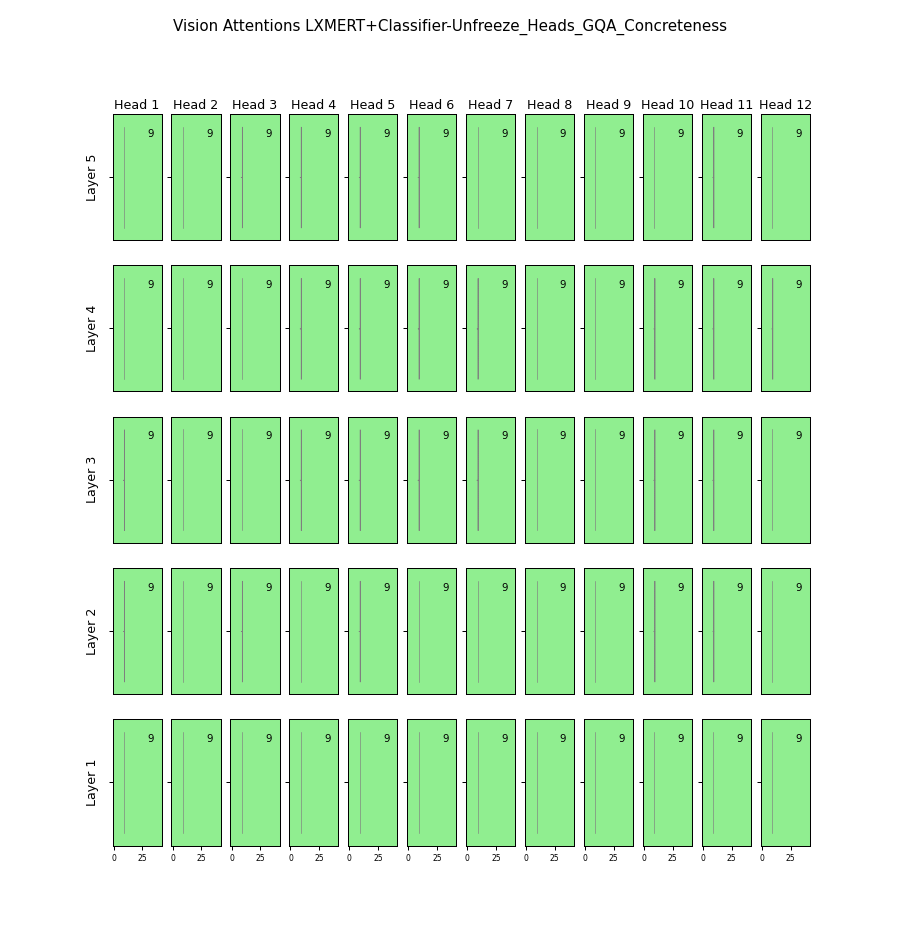
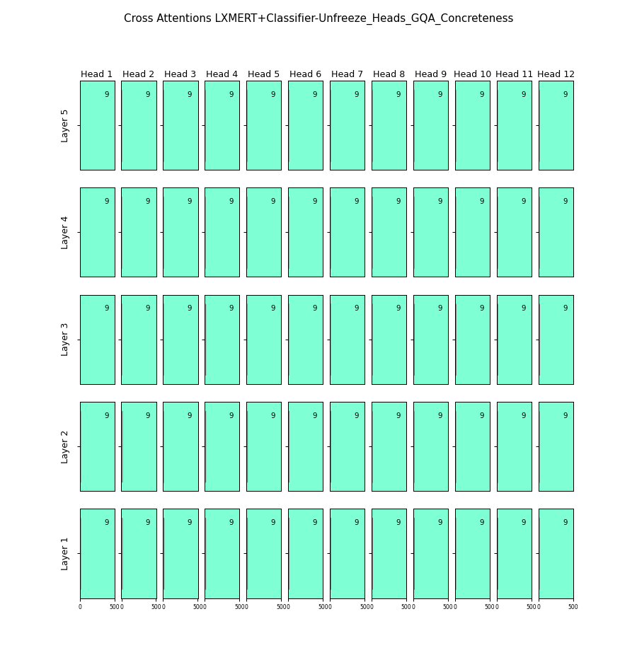
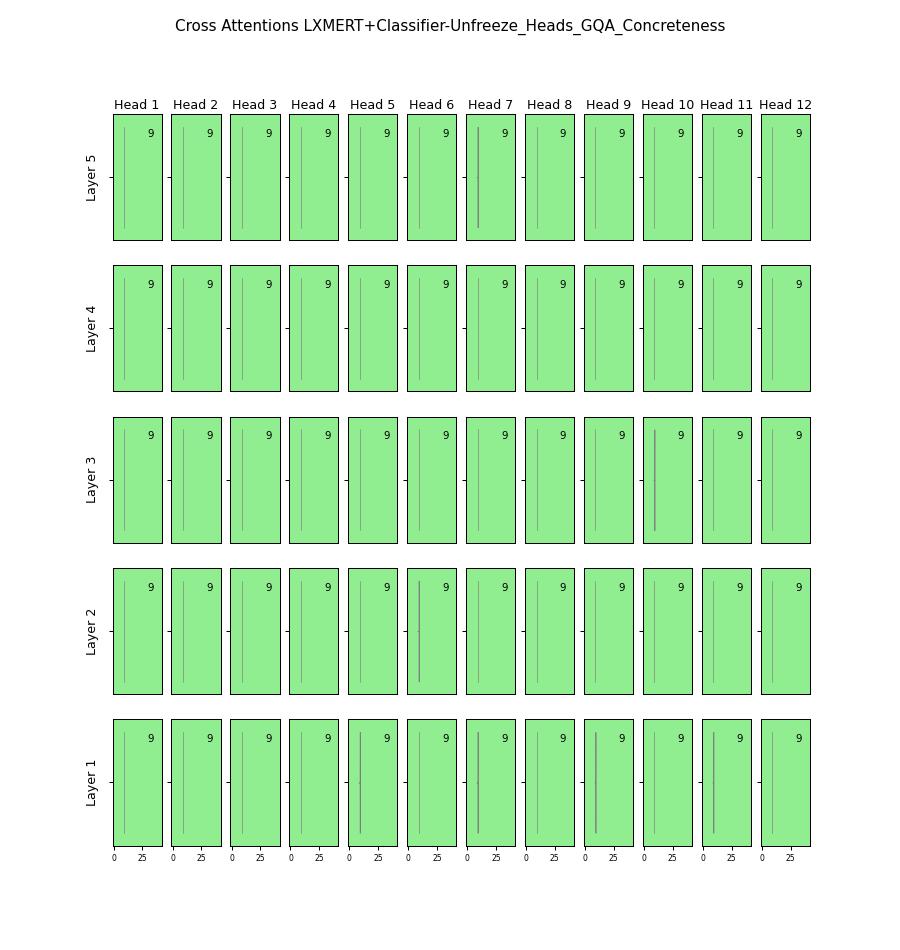

# Concreteness infromation etc for the GQA dataset
Concreteness study for GQA

## Lxmert + Classifier:
The first stable model i got running on GQA

### Unfreeze Heads
Training the attention heads as well as the classification layers
**Acc: 20%**

#### Language Attentions
Conc Pool|Abs Pool
-|-
|

#### Vision Attentions
Conc Pool|Abs Pool
-|-
|

#### Cross Attentions
Conc Pool|Abs Pool
-|-
|

### Unfreeze None
**Acc: 20%**
Only train the classification layers

