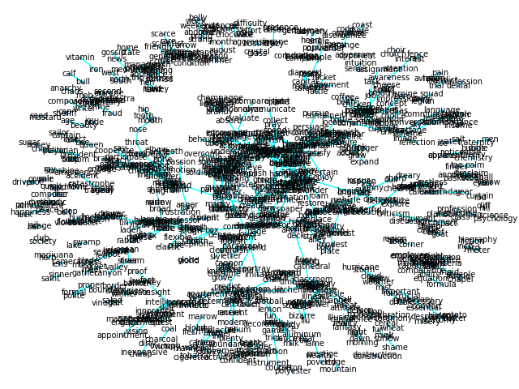

# Association, and other norm, clusters:
Run this plotting code with: `assoc_nx.sh`

## USF Association Metric
Potentially our proxy for associative (abstract) concepts
### Assoc > 0.7:

### Assoc > 0.4:

### Assoc > 0:

## Simlex999 Metric
Our proxy for categorical (concrete) concepts
### Simlex999 > 0.7:

### Simlex999 > 0.4:

### Simlex999 > 0:

