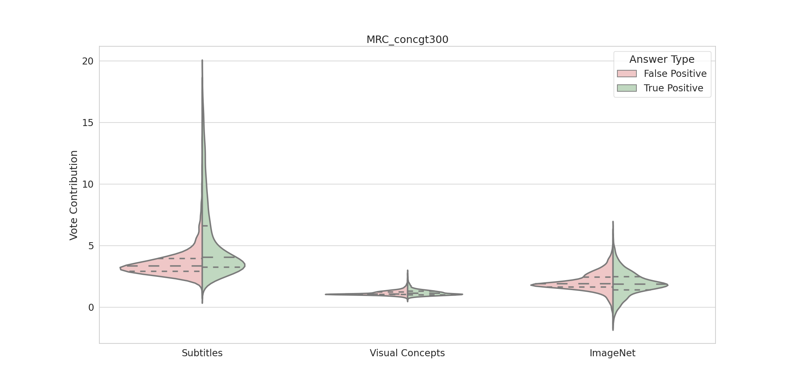
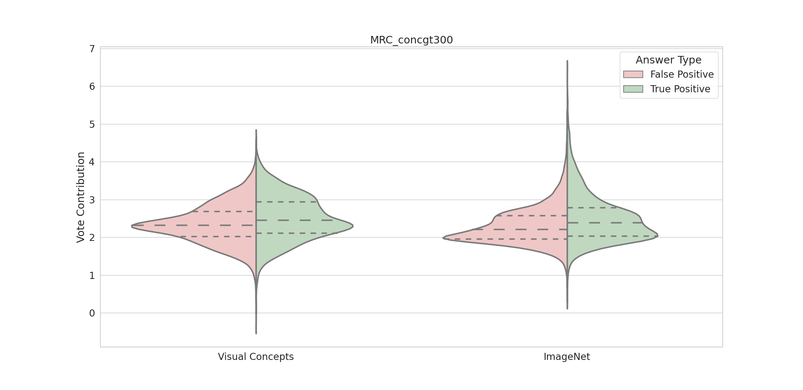
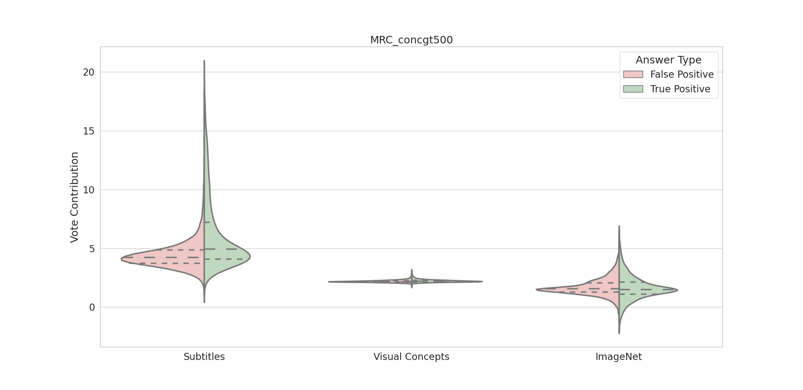
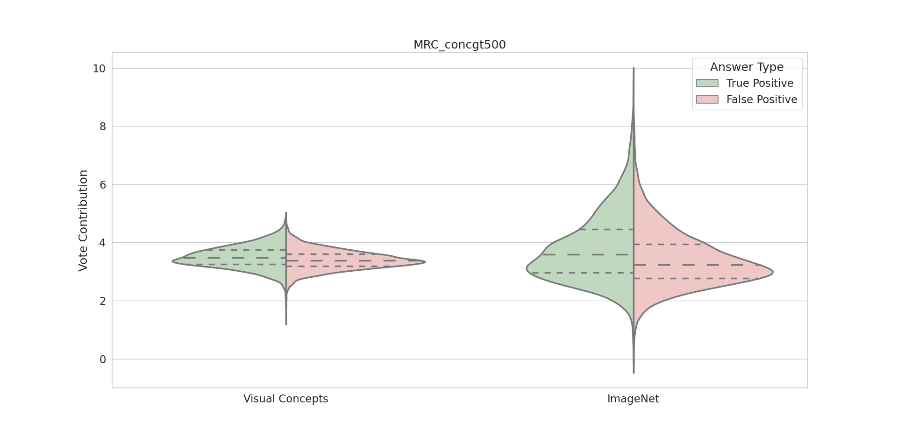
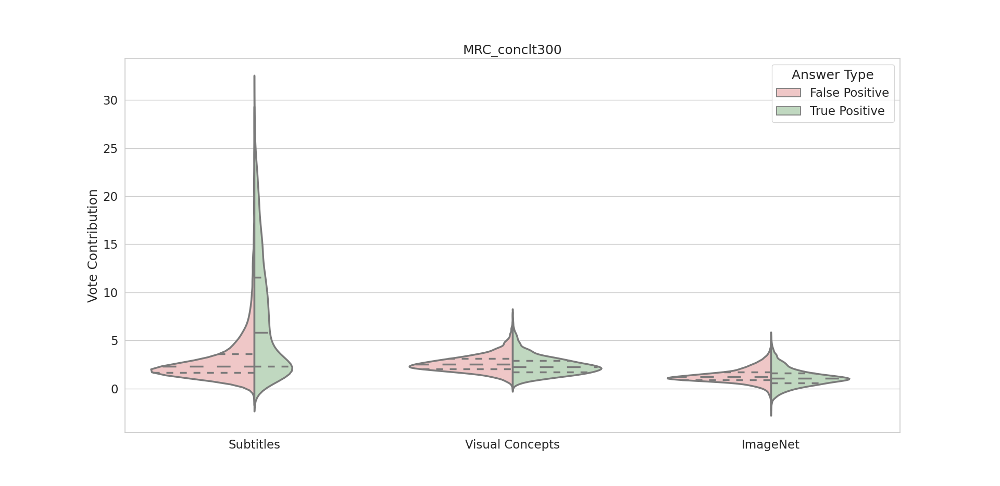
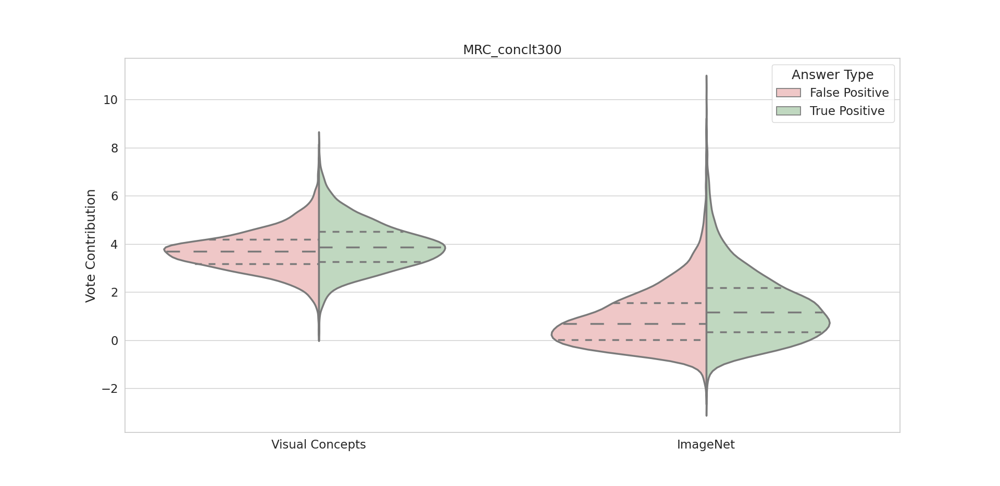
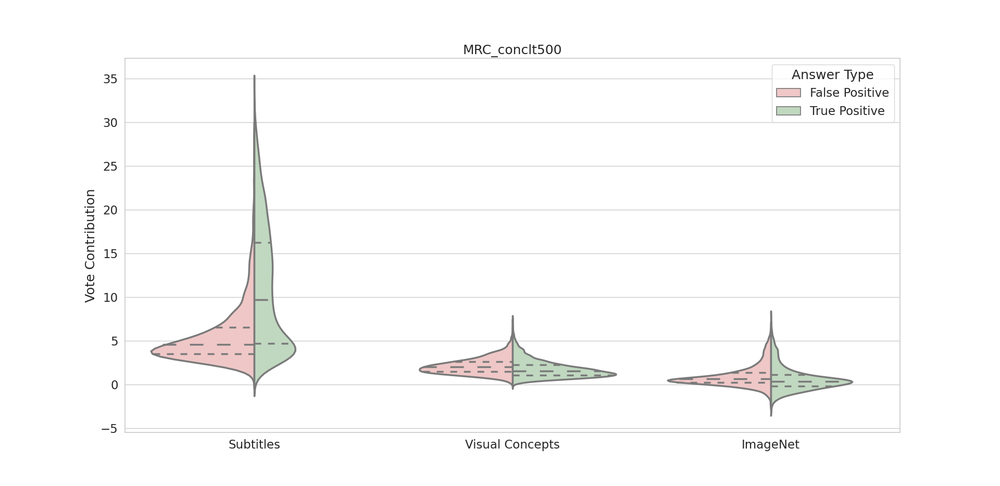
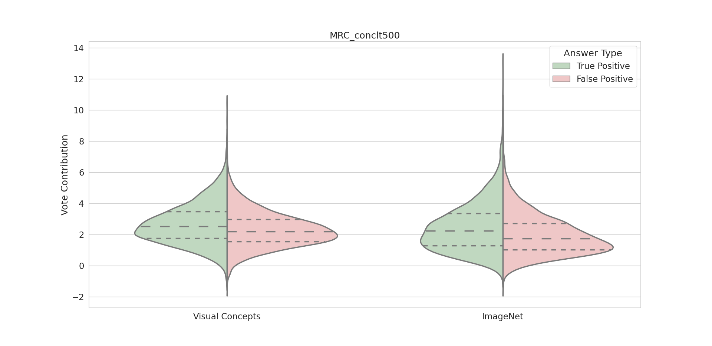

# Question-type distribution:
The performance gain/loss on each question type (versus the models own average, seen in the brackets in the descriptions on the left)

# TVQA feature responses:
(like the violins in our first paper)

## Disregarding Stopwords
The conditions on words that we KEEP. E.g: **concgt300** = ***KEEP*** words of concreteness ***GREATER-THAN 300***. (Note, scores are between 100-700, an upscaled version of the 1-7 likert scale used in MRC, I reckon this is because they don't like floating point numbers).
SVI | VI
|
|
|
|

## Clumsily including the concreteness of stopwords (Before) 

