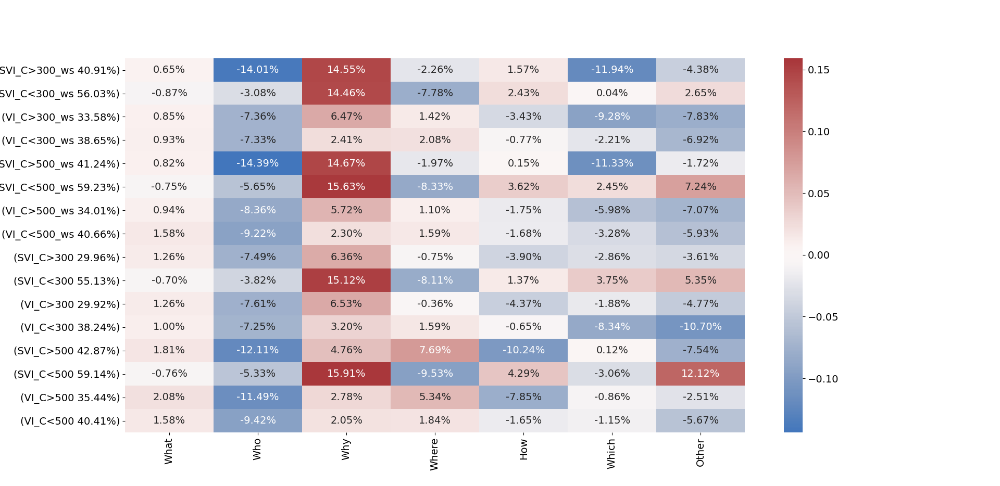

# Question-type distribution:
The performance gain/loss on each question type (versus the models own average, seen in the brackets in the descriptions on the left)

# TVQA feature responses:
(like the violins in our first paper)

## Disregarding Stopwords

## (Before) Clumsily including the concreteness of stopwords
