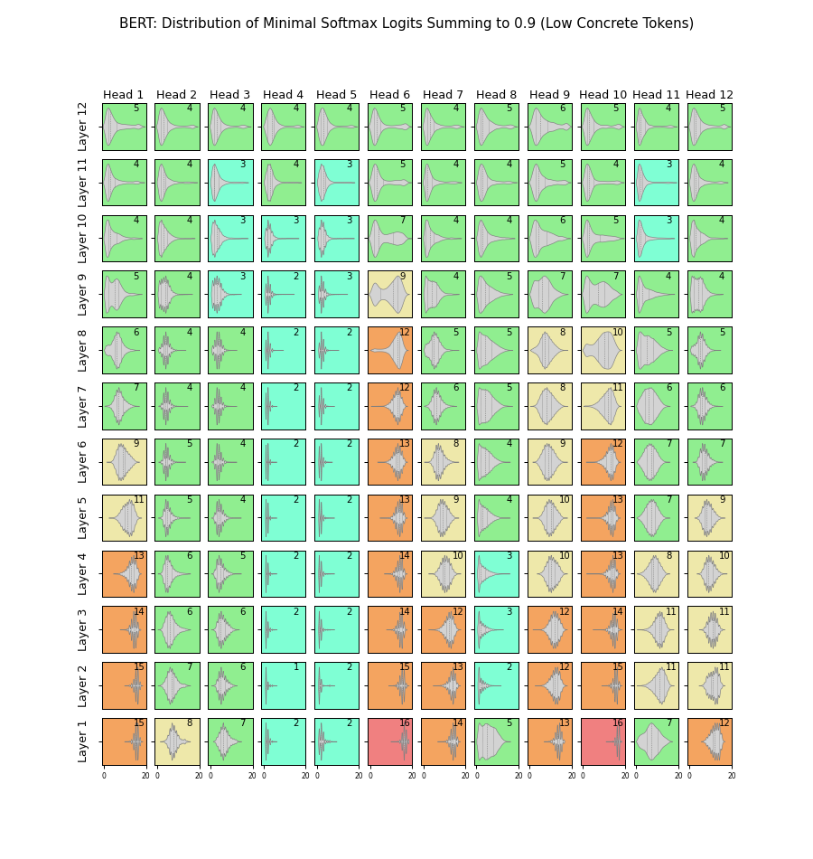

# BERT Analysis
Analysis of BERT models inspired by [Hopfield Networks is All You Need](https://arxiv.org/pdf/2008.02217.pdf). The aim is to find the differences that may reside in BERT attention heads between concrete and abstract tokens.

## 4_MT40k_bottopk: MT40k Top 3000 & Bottom 3000 Concretness:
Consider the number of logits in softmaxes of attention heads needed to reach 90% (intuitively, a measure of how focused on few or many tokens a given attention head is). A high number of logits required to sum to 0.9 means that there is some "metastable state" of the value in the key,value,query transformer triplet. Perhaps given the right conditions of abstractness and concreteness, we may see differences in how high or low this count is, potentially reflecting the associative or categorical nature implied in dual-coding theory.
(`BERT_mt40k_topbotk.sh`), you can vary k in the script easily.

**NOTE:** We process these as sequences of size 20 at a time, naturally extremely limited in an already rather blunt experiment. These are initial experimental results, more dedicated experiments with higher sequence lengths will take exponentially longer to process.
* These use Albert, a lite BERT

MT40k: Responses from heads of top 3000 concreteness tokens, split into sequences of 20 at a time:

MT40k: Responses from heads of bottom 3000 concreteness tokens (most abstract):

## 5_qnas_conc
Responses of questions and answers whose answers are abstract or concrete respectively.
* We take answers of concreteness > 0.95 and < 0.3 because there is a massive spike of concrete answers and far fewer abstract ones. 
We prepend the answers to the questions. This is because we need to set a maximum sequence length to run in reasonable time and can't risk the appended answer being cut.
* Maxmimum token length of 20 (including BoS and EoS). Done by the huggingface BERT tokeniser, where words-to-token mappings aren't always 1-to-1

TVQA: "ans+question" Responses for questions with correct answers of concreteness > 0.95. (2530)

TVQA: "ans+question" Responses for questions with correct answers of concreteness < 0.3. (613)

Left: Highly Concrete. Right: Highly Abstract

This experiment shows no notable differnence and is inconclusive. It is of course still limited.
